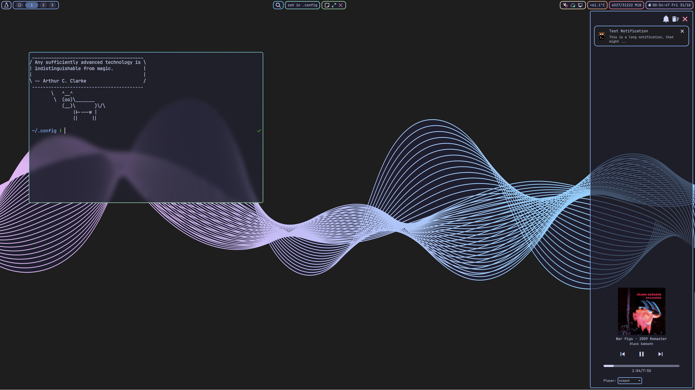

# qsdots

This repo contains my dotfiles for [quickshell](https://quickshell.org/), which I currently use for my desktop shell on Hyprland.

Quickshell is a toolkit for quickly building compontents for a desktop shell using the [QML](https://doc.qt.io/qt-6/qml-tutorial.html) language.



## Installation

> [!IMPORTANT]
> **USE AT YOU OWN RISK**  
> This is only really intended for my personal use, so just using this without changes will probably not work out of the box.
> Feel free to copy code for your own config tho.

First install dependencies (some might only be available in the AUR):

```
quickshell qt6-base qt6-declarative qt6-5compat hyprland libpipewire lm-sensors brightnessctl swww ttf-jetbrains-mono-nerd
```

Then clone the repo into your quickshell path. By default this is `~/.config/quickshell/`.

> [!NOTE]
> Even though quickshell supports multiple compositor, this config is intended to be used with Hyprland.
> It could probably be adjusted to work with different compositors though.
